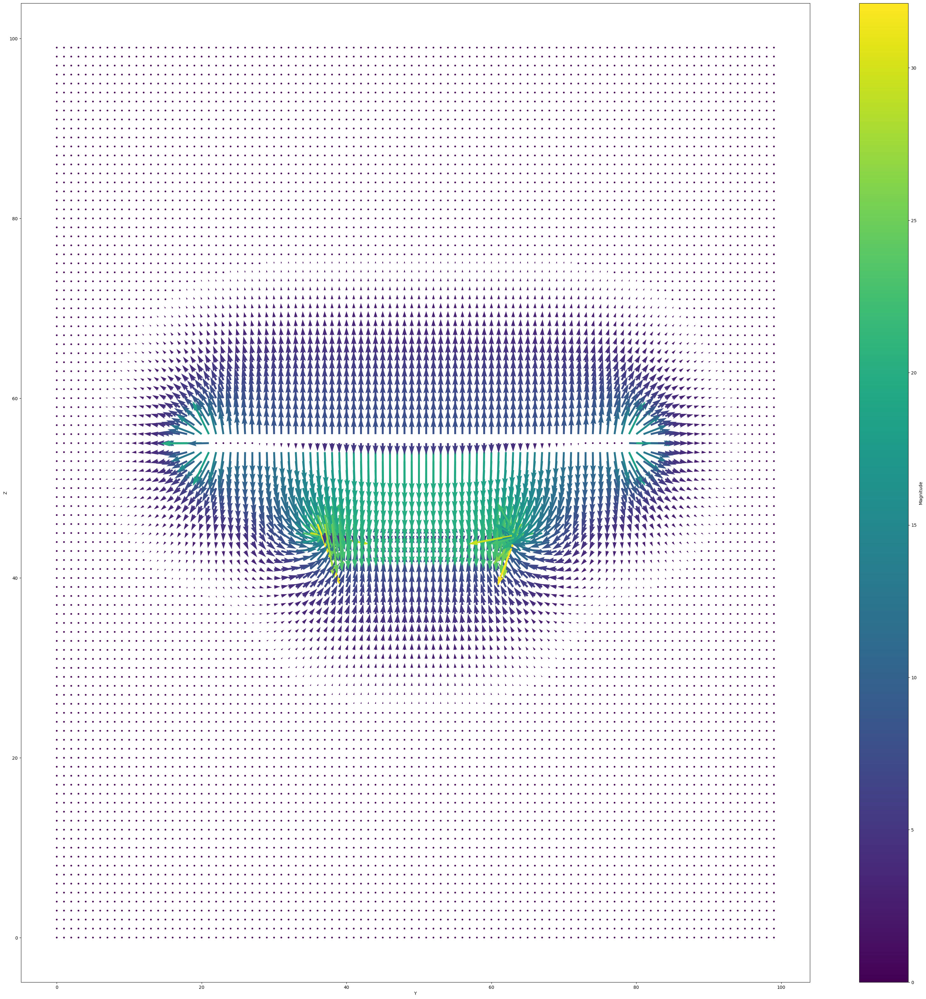

# PotentialSolver
Uses method of relaxation to solve a static electric potential and electric field. Solver accelerated with GPU using cupy, which increases speed of calculation by almost 3000x on my machine.  
CUDA 12.2  
Python 3.11  
The following is the electric field resulting from two circular oppositely charged disks. Can see the fringing fields at the edges and the more constant field towards the center.

